<p align="center">
  
  
  
  
  
</p>

<h1 align="center">🤖 Predictive Maintenance for Industrial Robotic Arms</h1>

<p align="center">
  <strong>Comparative Analysis of Machine Learning Models Using the CWRU Bearing Dataset</strong>
</p>

<p align="center">
  <em>An ML-based predictive maintenance system that classifies bearing faults, predicts fault severity, clusters fault patterns, and automates maintenance decisions using reinforcement learning.</em>
</p>

---

## 📑 Table of Contents

- [Overview](#-overview)
- [Key Features](#-key-features)
- [Project Structure](#-project-structure)
- [Dataset](#-dataset)
- [Data Preprocessing & Feature Engineering](#-data-preprocessing--feature-engineering)
- [Exploratory Data Analysis](#-exploratory-data-analysis)
- [Model Implementations](#-model-implementations)
  - [Classification (KNN, SVM, Decision Tree)](#1-classification)
  - [Polynomial Regression](#2-polynomial-regression)
  - [K-Means Clustering](#3-k-means-clustering)
  - [Q-Learning (Reinforcement Learning)](#4-q-learning-reinforcement-learning)
- [Ensemble Learning](#-ensemble-learning)
- [Comparative Analysis](#-comparative-analysis)
- [Interactive Dashboard](#-interactive-dashboard)
- [Installation & Usage](#-installation--usage)
- [Project Deliverables](#-project-deliverables)
- [Technologies Used](#-technologies-used)
- [Contributors](#-contributors)
- [References](#-references)

---

## 🎯 Overview

Industrial robotic arms depend heavily on rolling element bearings in their joints and actuators. **Bearing failures account for 40–50% of all rotating machinery failures**, causing costly unplanned downtime. This project builds a comprehensive predictive maintenance pipeline using the **Case Western Reserve University (CWRU) Bearing Dataset** — one of the most widely-used benchmarks in bearing fault diagnosis research.

The system addresses **three critical challenges**:

| Challenge | Approach | Algorithm |
|-----------|----------|-----------|
| **Fault Detection** | Classify bearing condition | KNN, SVM, Decision Tree + Ensembles |
| **Severity Estimation** | Predict fault diameter | Polynomial Regression (Degrees 1–4) |
| **Maintenance Decisions** | Recommend optimal action | Q-Learning (Reinforcement Learning) |

---

## ✨ Key Features

- 🔍 **3 Classification Models** — KNN, SVM, Decision Tree with GridSearchCV tuning
- 📈 **Polynomial Regression** — Severity prediction across degrees 1–4 with bias-variance analysis
- 🎯 **K-Means Clustering** — Unsupervised fault grouping with Silhouette & Davies-Bouldin metrics
- 🧠 **Q-Learning Agent** — Automated maintenance decision-making with convergence analysis
- 🏆 **Ensemble Learning** — Random Forest, AdaBoost, Gradient Boosting
- 📊 **Interactive Streamlit Dashboard** — Real-time fault diagnosis with adjustable sensor inputs
- 📋 **Complete Evaluation** — Accuracy, F1, RMSE, R², Silhouette Score, cumulative reward

---

## 📁 Project Structure

```
PMFIRA/
├── 📄 README.md                          # This file
├── 📓 mlr.ipynb                          # Main Jupyter notebook (all ML implementations)
├── 🖥️ app.py                             # Streamlit interactive dashboard
├── 💾 save_models.py                     # Model training & serialization script
│
├── 📂 data/
│   ├── feature_time_48k_2048_load_1.csv  # CWRU bearing dataset (2,300 samples × 10 cols)
│   └── phase1_data.pkl                   # Preprocessed data cache
│
├── 📂 models/
│   └── trained_models.pkl                # Serialized models, scalers, and metrics
│
├── 📂 plots/
│   ├── eda/                              # Exploratory data analysis plots
│   ├── classifiers/                      # KNN, SVM, DT confusion matrices
│   ├── regression/                       # Polynomial regression results
│   ├── clustering/                       # K-Means elbow, silhouette, PCA
│   ├── ensemble/                         # RF, GB confusion matrices
│   ├── reinforcement_learning/           # Q-Learning convergence & Q-table
│   └── comparison/                       # Model comparison charts
│
├── 📄 Predictive_Maintenance_Report.pdf  # Formal project report
├── 📄 Predictive_Maintenance_Report.docx # Editable report (Word format)
└── 📄 final MLR ppt.pptx                # Presentation slides
```

---

## 📊 Dataset

### CWRU Bearing Dataset

The data was collected from a **2-HP Reliance Electric motor** test rig at Case Western Reserve University. Accelerometer sensors at the drive end recorded vibration signals at **48,000 Hz** sampling rate.

| Property | Value |
|----------|-------|
| **Total Samples** | 2,300 |
| **Features** | 9 time-domain statistical features |
| **Fault Types** | Normal, Ball, Inner Race, Outer Race |
| **Severity Levels** | 0.007", 0.014", 0.021" diameter |
| **Classes** | 10 (fault × severity combinations) |
| **Balance** | Perfectly balanced (230 samples/class) |
| **Missing Values** | 0 |

### Feature Description

| Feature | Description | Physical Meaning |
|---------|-------------|-----------------|
| `max` | Maximum amplitude | Peak vibration intensity |
| `min` | Minimum amplitude | Negative peak vibration |
| `mean` | Mean value | Signal DC offset / bias |
| `sd` | Standard deviation | Signal energy / spread |
| `rms` | Root mean square | Overall vibration intensity |
| `skewness` | Third statistical moment | Asymmetry of vibration distribution |
| `kurtosis` | Fourth statistical moment | Impulsiveness / peakedness |
| `crest` | Crest factor (peak/RMS) | Ratio of peak to average energy |
| `form` | Form factor (RMS/mean) | Signal shape indicator |

### Class Distribution

The dataset contains **10 balanced classes** — each with exactly 230 samples:

<p align="center">
  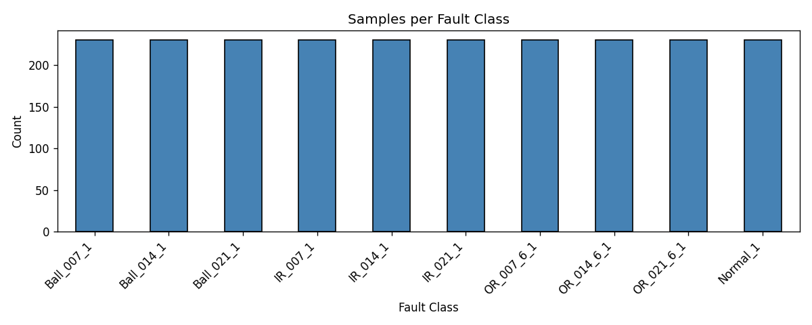
</p>

---

## 🔧 Data Preprocessing & Feature Engineering

### Pipeline

```
Raw Vibration Signal (48kHz)
    │
    ▼
Window Segmentation (2,048 samples/window)
    │
    ▼
Feature Extraction (9 time-domain features)
    │
    ▼
Feature Engineering
    ├── fault_type: 10 classes → 4 groups (Normal/Ball/InnerRace/OuterRace)
    └── severity: Numerical fault diameter (0.0, 0.007, 0.014, 0.021)
    │
    ▼
StandardScaler (zero mean, unit variance)
    │
    ▼
Train/Test Split (80/20, stratified, random_state=42)
```

**Key Decisions:**
- **StandardScaler** fitted on training data only to prevent data leakage
- **LabelEncoder** maps fault types to integers: Ball=0, InnerRace=1, Normal=2, OuterRace=3
- **Stratified split** maintains class proportions across train (1,840) and test (460) sets

---

## 🔬 Exploratory Data Analysis

### Feature Correlation Heatmap

The correlation analysis reveals that `sd` and `rms` are almost perfectly correlated (r > 0.99), as RMS approximates standard deviation for zero-mean signals. `max` shows strong positive correlation with `sd`/`rms`, indicating higher fault severity produces larger vibrations.

<p align="center">
  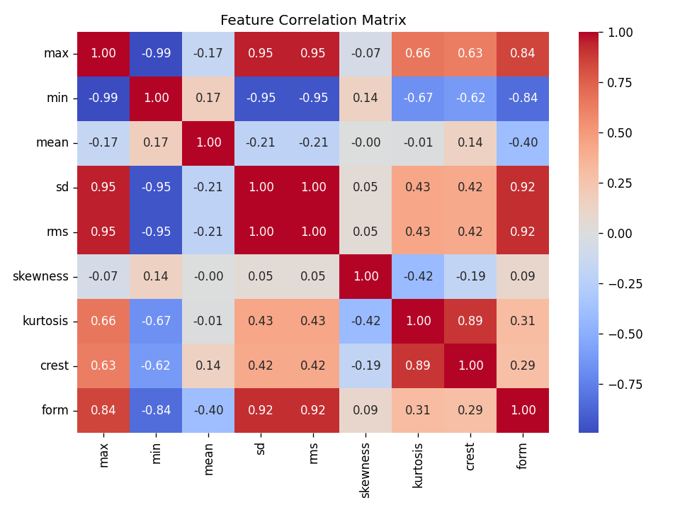
</p>

### RMS Distribution by Fault Type

RMS is the most discriminative feature — clear separation exists between Normal (low RMS) and faulty bearings (higher RMS):

<p align="center">
  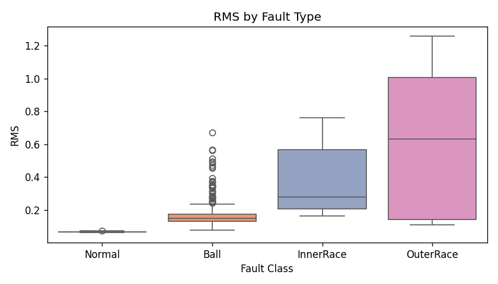
</p>

### PCA Visualization

PCA projection onto 2 components shows natural clustering of fault types, confirming the features contain sufficient discriminative information:

<p align="center">
  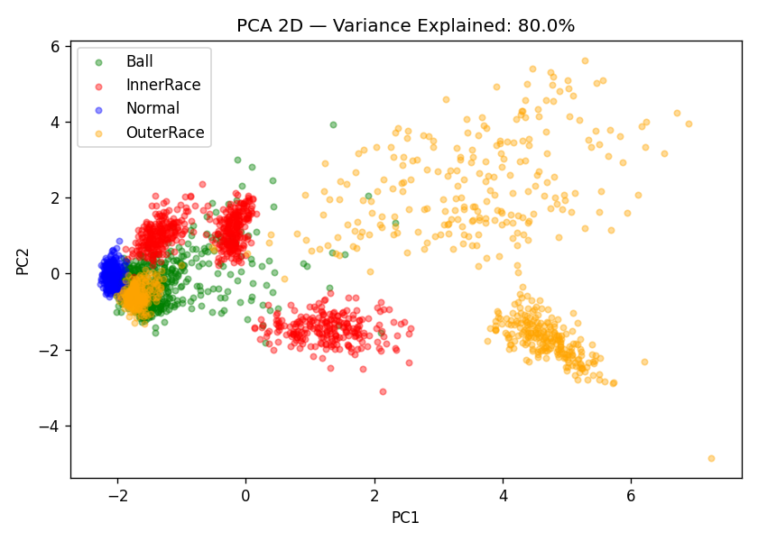
</p>

---

## 🤖 Model Implementations

### 1. Classification

Three classification algorithms were implemented with **GridSearchCV (5-fold CV)** for hyperparameter tuning:

#### K-Nearest Neighbors (KNN)

- **Best params:** K=3, distance weighting, manhattan metric
- Non-parametric, instance-based learning
- Effective for localized fault clusters, but O(n·d) prediction time

<p align="center">
  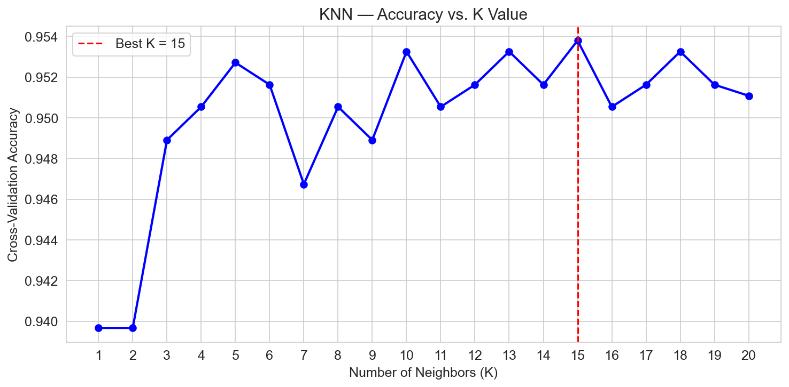
</p>

<p align="center">
  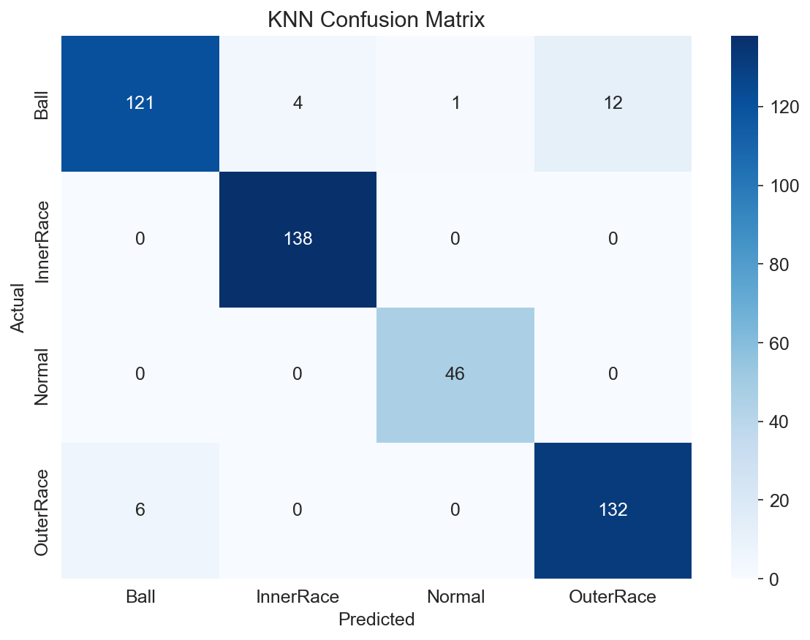
</p>

#### Support Vector Machine (SVM)

- **Best params:** C=10, gamma=scale, RBF kernel
- Maximizes margin between classes with non-linear decision boundaries
- Benefits significantly from feature scaling

<p align="center">
  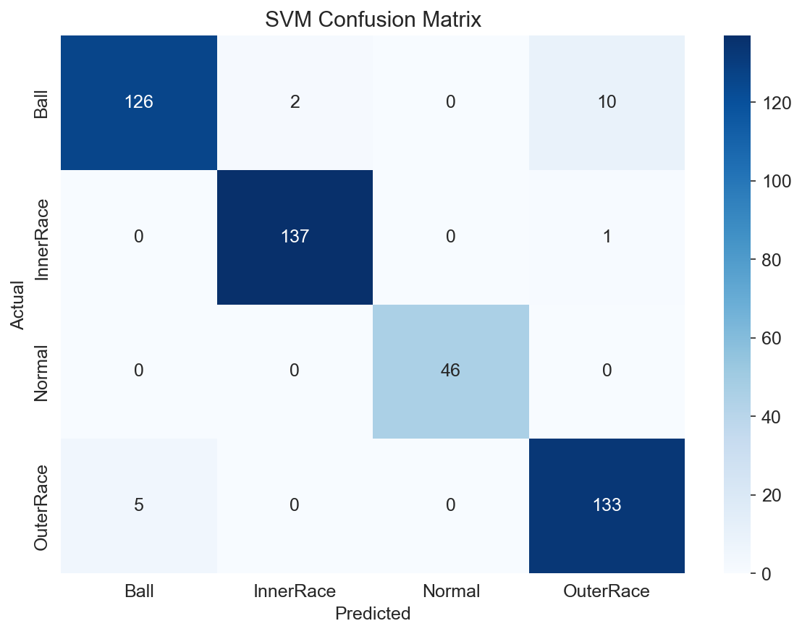
</p>

#### Decision Tree

- **Best params:** Tuned max_depth, min_samples_split, criterion
- Most interpretable classifier — human-readable decision rules
- Feature importance reveals `rms`, `sd`, `max`, and `kurtosis` as top features

<p align="center">
  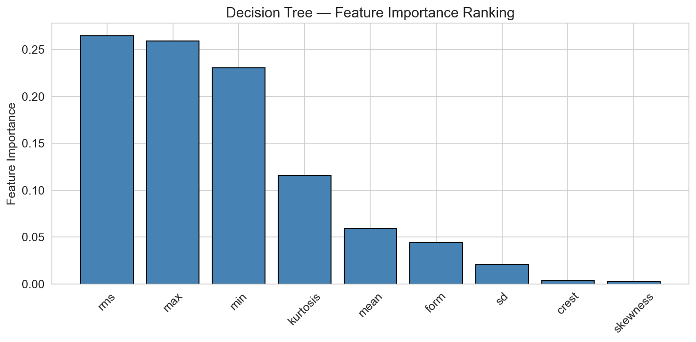
</p>

<p align="center">
  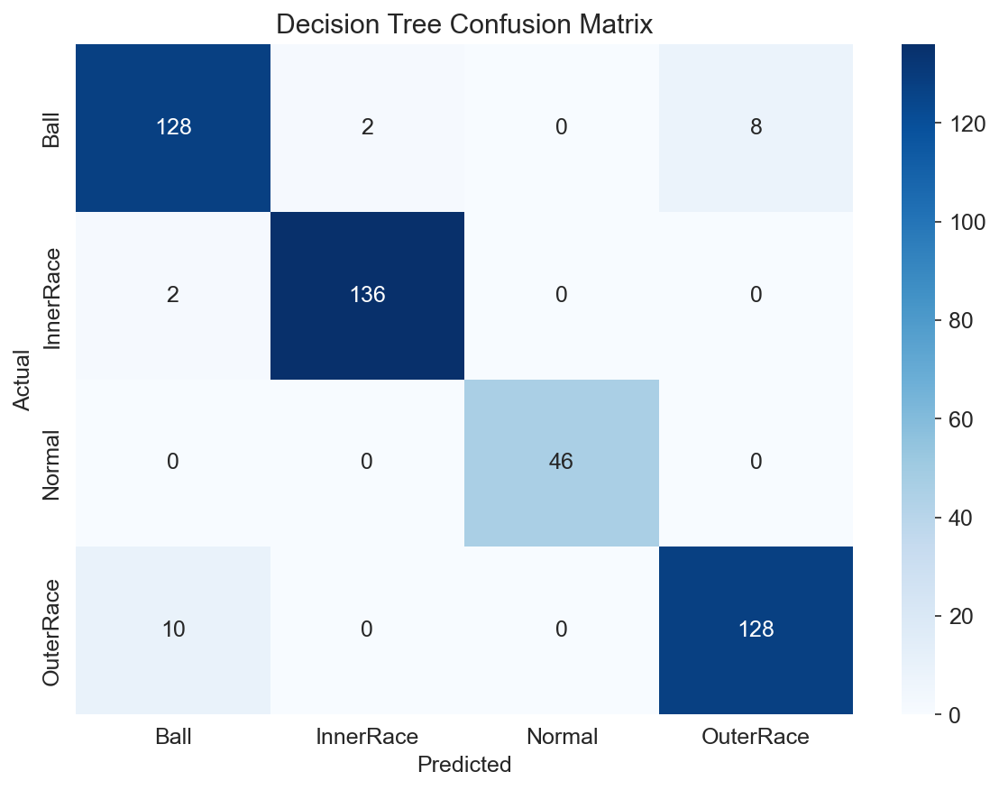
</p>

<details>
<summary>📊 Click to view Decision Tree Visualization</summary>
<p align="center">
  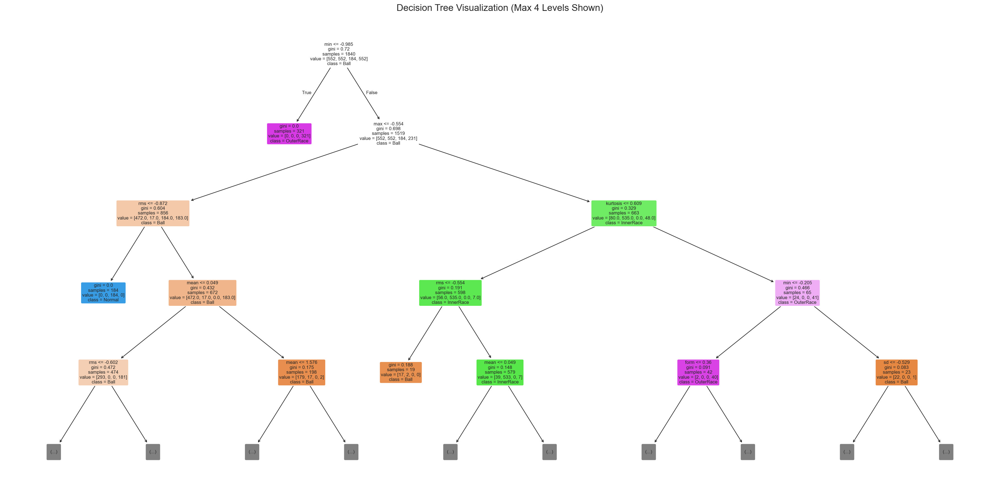
</p>
</details>

---

### 2. Polynomial Regression

**Goal:** Predict fault severity (diameter in inches) from vibration features.

Polynomial degrees 1 through 4 were compared on faulty samples only (severity > 0):

| Degree | RMSE | MAE | R² | Note |
|--------|------|-----|-----|------|
| 1 | 0.005036 | 0.004491 | 0.2175 | Underfits (linear) |
| 2 | 0.002670 | 0.001951 | 0.7801 | Good fit |
| **3** ⭐ | **0.002394** | **0.001508** | **0.8232** | **Best fit** |
| 4 | 0.042595 | 0.004198 | -54.978 | Severe overfitting |

> **Best model: Degree 3** — demonstrates the classic bias-variance tradeoff. Degree 4 captures noise rather than signal patterns.

<p align="center">
  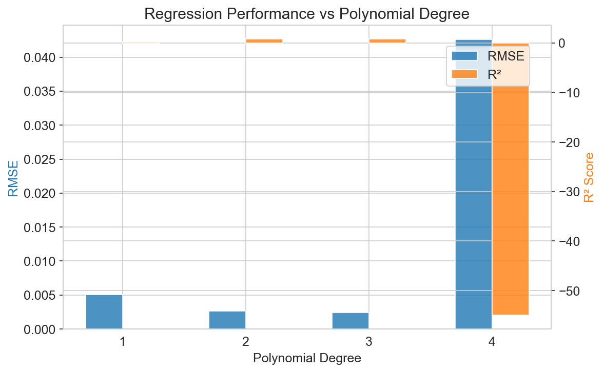
</p>

<p align="center">
  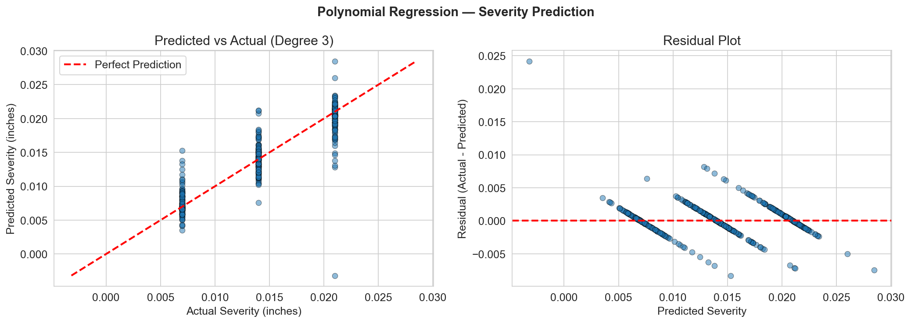
</p>

---

### 3. K-Means Clustering

**Goal:** Discover natural fault groupings without labels (unsupervised).

Evaluated for K = 2 to 15 using:
- **Elbow Method** (inertia)
- **Silhouette Score** (higher is better)
- **Davies-Bouldin Index** (lower is better)

<p align="center">
  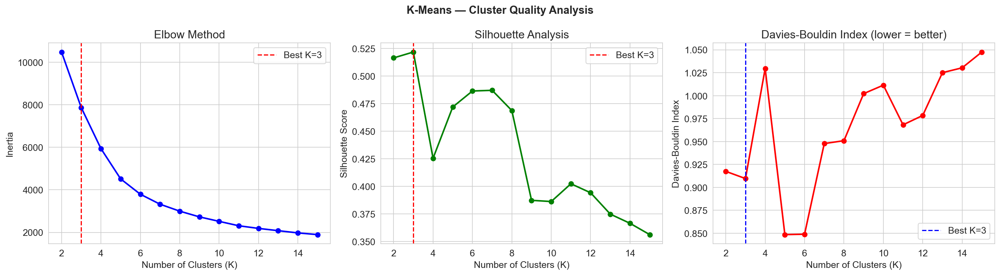
</p>

PCA 2D projection comparing true labels vs cluster assignments:

<p align="center">
  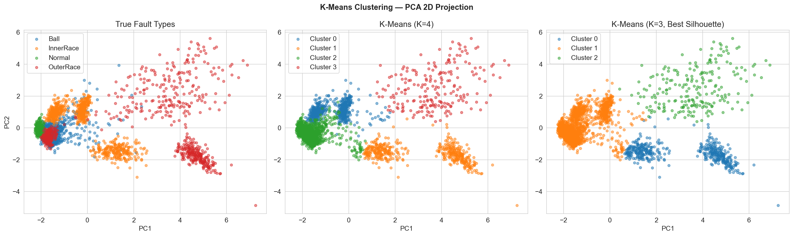
</p>

> K=4 clusters show strong correspondence with actual fault types, validating unsupervised fault detection.

---

### 4. Q-Learning (Reinforcement Learning)

**Goal:** Automate maintenance decision-making based on fault state.

#### Environment Design

| State \ Action | Continue | Schedule Maintenance | Emergency Stop |
|----------------|----------|---------------------|----------------|
| **Normal** | +10 | -5 | -20 |
| **Low Fault** (0.007") | -5 | +15 | -10 |
| **Medium Fault** (0.014") | -20 | +10 | +5 |
| **High Fault** (0.021") | -50 | 0 | +20 |

#### Training Configuration

| Parameter | Value |
|-----------|-------|
| Episodes | 10,000 |
| Steps/Episode | 50 |
| Learning Rate (α) | 0.1 |
| Discount Factor (γ) | 0.95 |
| Exploration | ε-greedy (1.0 → 0.01) |

#### Learned Optimal Policy

| Fault State | Recommended Action |
|-------------|-------------------|
| Normal | ✅ Continue Operating |
| Low Fault | 🔧 Schedule Maintenance |
| Medium Fault | 🔧 Schedule Maintenance |
| High Fault | 🛑 Emergency Stop |

<p align="center">
  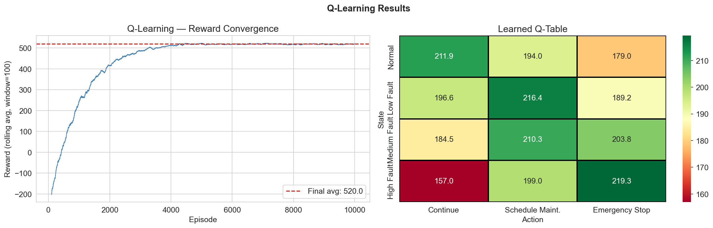
</p>

---

## 🏆 Ensemble Learning

Three ensemble methods were applied to improve classification performance:

| Method | Type | Description |
|--------|------|-------------|
| **Random Forest** | Bagging | Ensemble of DTs with bootstrap + random features |
| **AdaBoost** | Boosting | Sequential weak learners focused on hard samples |
| **Gradient Boosting** | Boosting | Fits trees to residual errors via gradient descent |

<p align="center">
  
  &nbsp;&nbsp;&nbsp;
  
</p>

> **Result:** Ensemble methods improve accuracy by **1–3%** over individual classifiers with lower variance.

---

## 📈 Comparative Analysis

### Model Performance Comparison

<p align="center">
  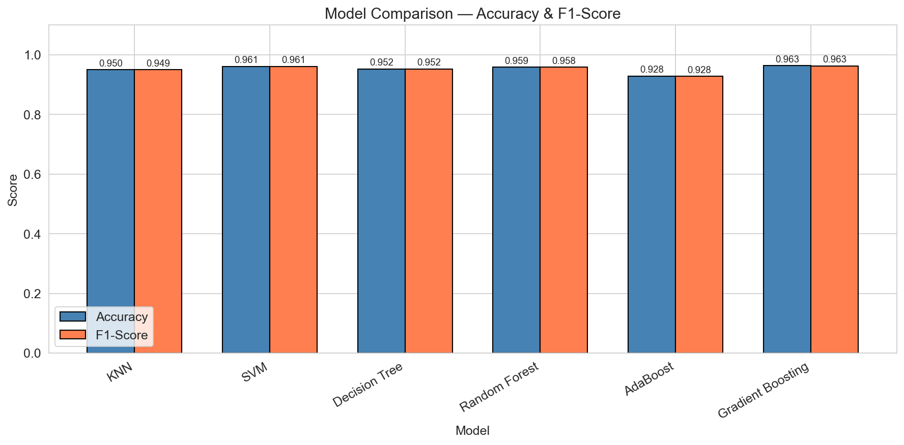
</p>

### 10-Fold Cross-Validation Stability

<p align="center">
  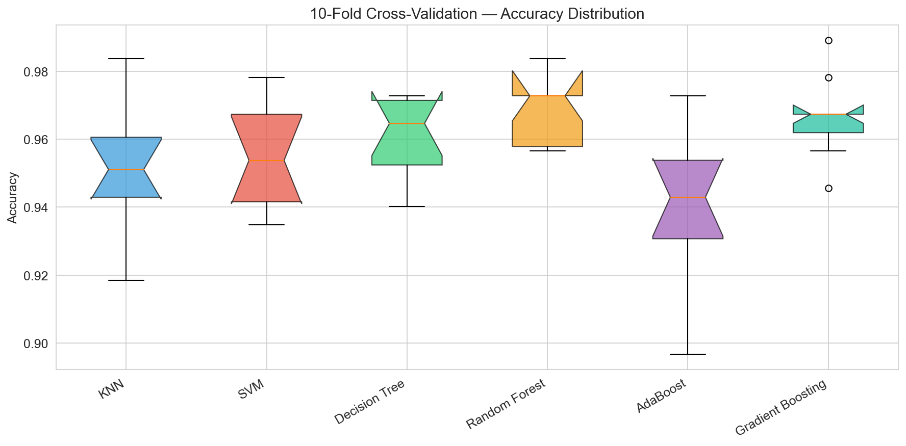
</p>

### Training Time Comparison

<p align="center">
  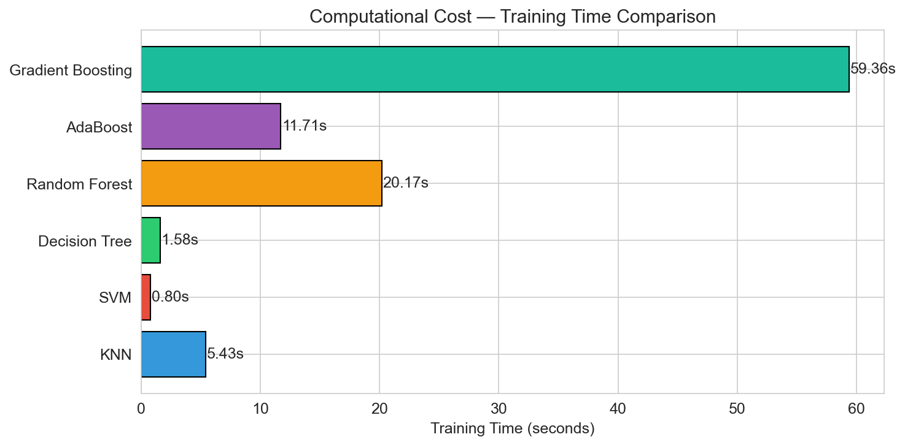
</p>

### Computational Complexity

| Model | Train Complexity | Predict Complexity | Memory | Key Strength |
|-------|------------------|--------------------|--------|--------------|
| KNN | O(1) – lazy | O(n·d) | High | Simple, no training |
| SVM | O(n²·d) to O(n³) | O(n_sv·d) | Moderate | Strong margins |
| Decision Tree | O(n·d·log n) | O(log n) | Low | Interpretable |
| Random Forest | O(T·n·d·log n) | O(T·log n) | Moderate | Low variance |
| Gradient Boosting | O(T·n·d) | O(T·log n) | Moderate | Highest accuracy |
| Poly. Regression | O(n·d^p) | O(d^p) | Low | Severity prediction |
| K-Means | O(n·K·d·I) | O(K·d) | Low | Anomaly detection |

### Key Findings

- **Gradient Boosting** achieves the highest classification accuracy with low variance
- **Decision Tree** is fastest and most interpretable — ideal for safety-critical applications
- **KNN** performs well but has O(n·d) prediction time — a bottleneck for real-time systems
- **Polynomial Degree 3** is optimal for severity prediction (R² = 0.8232)
- **K-Means (K=4)** naturally discovers fault groupings without supervision
- **Q-Learning** converges to the correct maintenance policy within ~2,000 episodes

---

## 🖥️ Interactive Dashboard

A **Streamlit-based real-time dashboard** provides an interactive interface for fault diagnosis:

### Features
- 🎛️ Adjustable sensor input sliders for all 9 vibration features
- 🔄 Model selector (KNN, SVM, Decision Tree, Random Forest, Gradient Boosting)
- 📊 Real-time fault classification with confidence scores
- 📈 All-models prediction comparison table
- 📉 Polynomial regression analysis with degree comparison
- 🧠 Q-Learning decision matrix visualization
- 📋 Load sample data from the dataset

### Run the Dashboard

```bash
streamlit run app.py
```

The dashboard will open at `http://localhost:8501`.

---

## 🚀 Installation & Usage

### Prerequisites

- Python 3.10 or higher
- pip package manager

### Setup

```bash
# 1. Clone the repository
git clone https://github.com/shaheerzafarr/Predictive-Maintenance-for-Industrial-Robotic-Arms.git
cd Predictive-Maintenance-for-Industrial-Robotic-Arms

# 2. Install dependencies
pip install numpy pandas scikit-learn matplotlib seaborn plotly streamlit

# 3. (Optional) Retrain models from scratch
python save_models.py

# 4. Launch the interactive dashboard
streamlit run app.py
```

### Run the Notebook

```bash
# Open the Jupyter notebook for full analysis
jupyter notebook mlr.ipynb
```

---

## 📋 Project Deliverables

| Deliverable | File | Description |
|-------------|------|-------------|
| ✅ **Source Code** | `mlr.ipynb`, `app.py`, `save_models.py` | Well-documented, reproducible |
| ✅ **Project Report** | `Predictive_Maintenance_Report.pdf` | Formal report with all sections |
| ✅ **Report (Editable)** | `Predictive_Maintenance_Report.docx` | Word format for editing |
| ✅ **Presentation** | `final MLR ppt.pptx` | 15-minute presentation slides |
| ✅ **Dataset** | `data/feature_time_48k_2048_load_1.csv` | Preprocessed CWRU dataset |
| ✅ **Trained Models** | `models/trained_models.pkl` | Serialized models & metrics |
| ✅ **Visualizations** | `plots/` | All EDA, model, and comparison plots |
| ✅ **Dashboard** | `app.py` | Interactive Streamlit application |

---

## 🛠️ Technologies Used

| Category | Tools |
|----------|-------|
| **Language** | Python 3.10+ |
| **ML Framework** | scikit-learn (classification, regression, clustering) |
| **Data Processing** | NumPy, Pandas |
| **Visualization** | Matplotlib, Seaborn, Plotly |
| **Dashboard** | Streamlit |
| **Report Generation** | fpdf2, python-docx |
| **Presentation** | python-pptx |
| **Version Control** | Git, GitHub |

---

## 👥 Contributors

| Name | Role |
|------|------|
| **Shaheer Zafar** | Project Lead & Development |
| Member 2 | — |
| Member 3 | — |
| Member 4 | — |
| Member 5 | — |

---

## 📚 References

1. Case Western Reserve University Bearing Data Center. https://engineering.case.edu/bearingdatacenter
2. Loparo, K. A. (2012). *Bearings Vibration Data Set*. Case Western Reserve University.
3. Pedregosa, F. et al. (2011). Scikit-learn: Machine Learning in Python. *JMLR*, 12, 2825-2830.
4. Lei, Y. et al. (2020). Applications of machine learning to machine fault diagnosis: A review. *Mechanical Systems and Signal Processing*, 138, 106587.
5. Watkins, C. J., & Dayan, P. (1992). Q-learning. *Machine Learning*, 8(3-4), 279-292.
6. Breiman, L. (2001). Random Forests. *Machine Learning*, 45(1), 5-32.
7. Friedman, J. H. (2001). Greedy Function Approximation: A Gradient Boosting Machine. *Annals of Statistics*, 29(5), 1189-1232.

---

<p align="center">
  <strong>⭐ If you found this project helpful, please give it a star! ⭐</strong>
</p>

<p align="center">
  <em>Built with ❤️ for Predictive Maintenance in Robotics</em>
</p>
